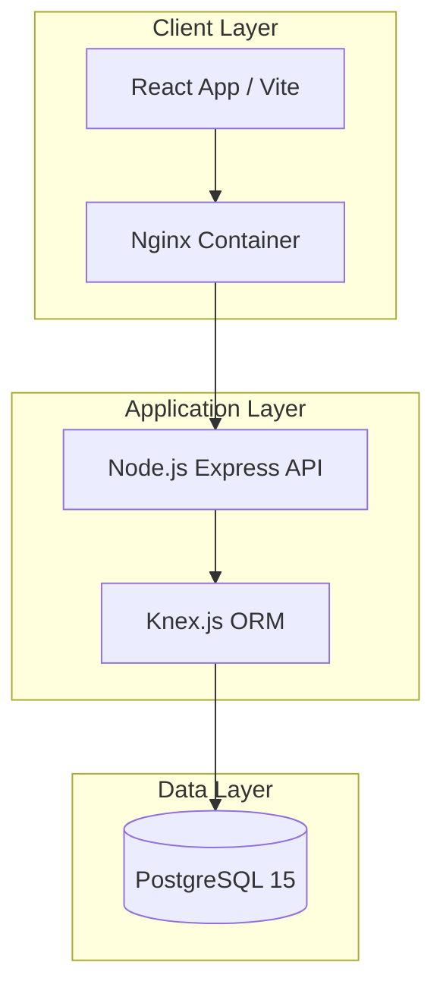
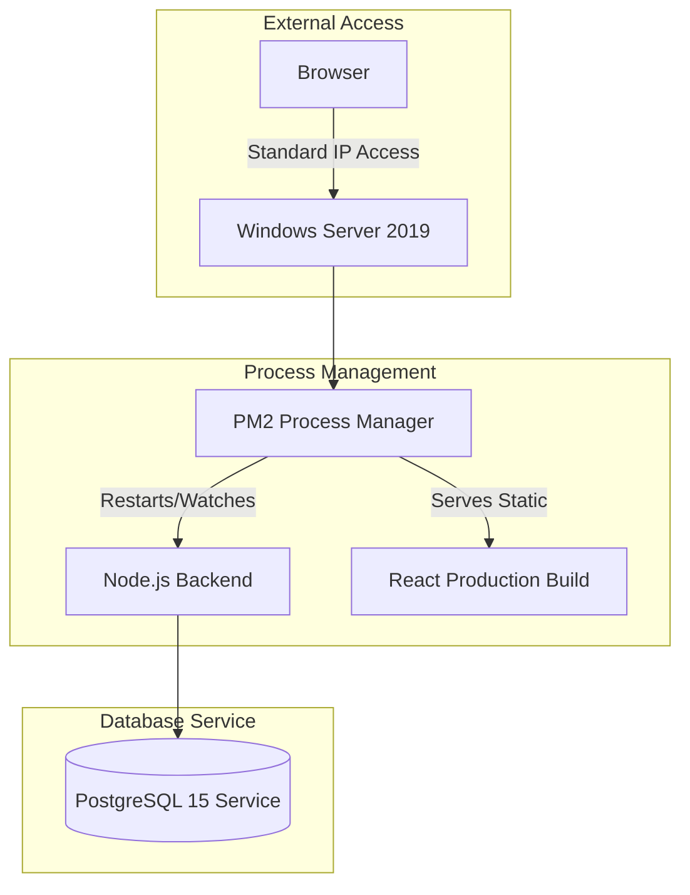
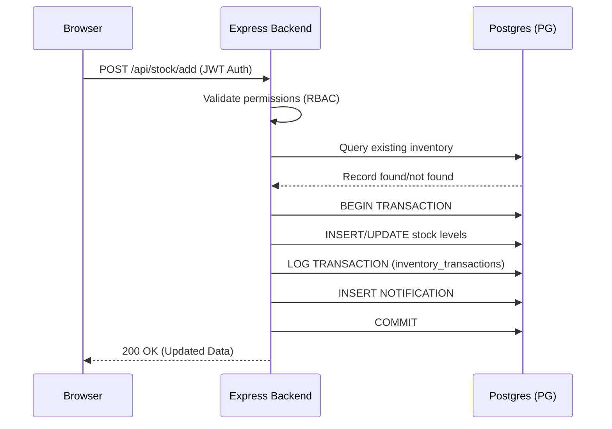

# Phoenix Inventory: Architectural Overview

This document provides a complete technical layout of the Phoenix Inventory system, detailing the software architecture, data flow, database schema, and deployment strategies optimized for both **Docker** and **Native Windows Server 2019** environments.

---

## 1. High-Level System Architecture

The system follows a classic **Three-Tier Architecture**. It is designed to be deployment-agnostic, supporting both containerized environments and native server installations.

### 1.1. Docker/Containerized Model
Used for development and Linux-based cloud deployments.

### 1.2. Native Windows Server Model
The optimized path for **Windows Server 2019** where Docker is not available.

---

## 2. Process Flow Representations

### 2.1. Request Lifecycle: Stock Update

---

## 3. Database Architecture (PostgreSQL)

The system uses a highly structured relational schema designed for audit-trail integrity and multi-tenant performance.

### 3.1. Core Tables & Field Definitions

#### `users`
| Field | Type | Description |
| :--- | :--- | :--- |
| `id` | SERIAL (PK) | Unique identifier for the user. |
| `name` | STRING | Full name of the operative. |
| `email` | STRING (UNIQ) | Login credential. |
| `password` | STRING | Bcrypt hashed password. |
| `role` | ENUM | `super_admin`, `admin`, `user`. |
| `status` | STRING | operative status: `active`, `inactive`. |

#### `products`
| Field | Type | Description |
| :--- | :--- | :--- |
| `id` | SERIAL (PK) | Unique identifier for the asset. |
| `name` | STRING | Product nomenclature. |
| `sku` | STRING (UNIQ) | Stock Keeping Unit (Unique identifier). |
| `description`| TEXT | Asset details/specifications. |

#### `inventory` (Active Stock)
| Field | Type | Description |
| :--- | :--- | :--- |
| `id` | SERIAL (PK) | Primary record ID. |
| `product_id` | INT (FK) | Relation to `products.id`. |
| `warehouse_id`| INT | Geographic facility ID. |
| `quantity` | INT | Current stock count. |
| `shelf_code` | STRING | Precise physical location (e.g., A-101). |

#### `inventory_transactions` (Audit Logs)
| Field | Type | Description |
| :--- | :--- | :--- |
| `id` | SERIAL (PK) | Audit log ID. |
| `product_id` | INT (FK) | The asset involved. |
| `type` | ENUM | `IN`, `OUT`, `ADJUSTMENT`. |
| `quantity` | INT | Amount moved. |
| `user_id` | INT (FK) | Operative who performed the action. |
| `notes` | TEXT | Reason for movement (e.g., "Monthly Audit"). |

---

## 4. Production Standards & Optimization

### 4.1. Server-Side Security
- **JWT Stateless Auth**: Tokens expire every 15 minutes; Refresh tokens used for secure session rotation.
- **Bcrypt Hashing**: 10 rounds of salt to prevent rainbow table attacks.
- **Helmet.js**: Implements 15+ individual security headers to block XSS and clickjacking.
- **Rate Limiting**: Protects Auth and Data routes from Brute Force and DoS.

### 4.2. Performance Optimization
- **Database Indexing**: B-Tree indexes on `sku` and `product_id` for $O(\log n)$ query speed.
- **Nginx Gzip**: (Optional) Compresses assets before delivery to reduce bandwidth on IP-based connections.
- **Connection Pooling**: Uses the `pg` pooler to manage database connections efficiently across parallel requests.
- **PM2 Clustering**: Leverages multiple CPU cores on the Windows Server to process concurrent API requests.

---
Verified by Antigravity Integration Node
