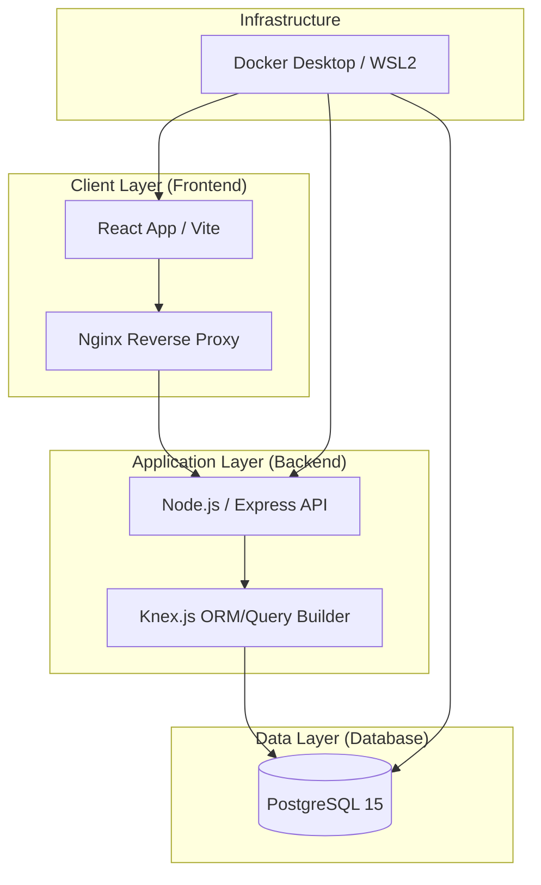
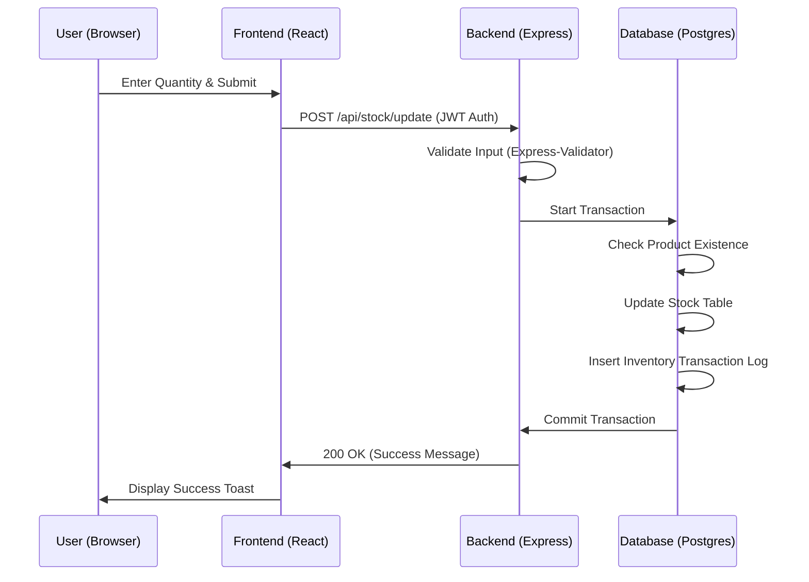
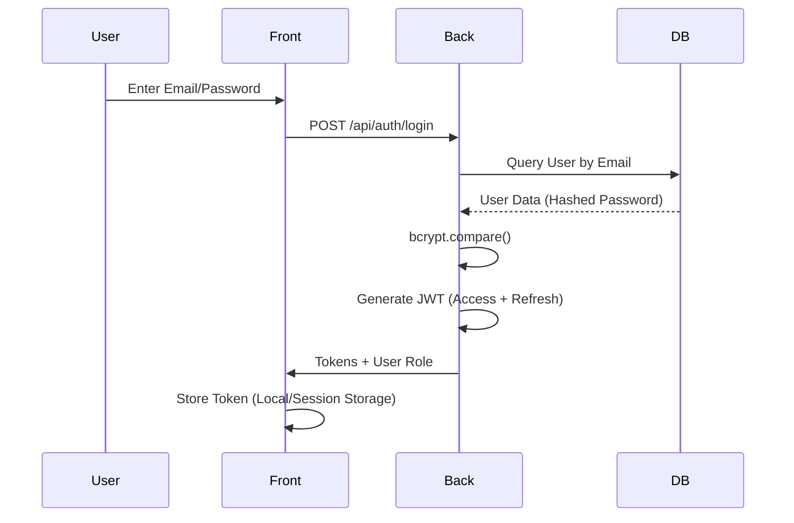
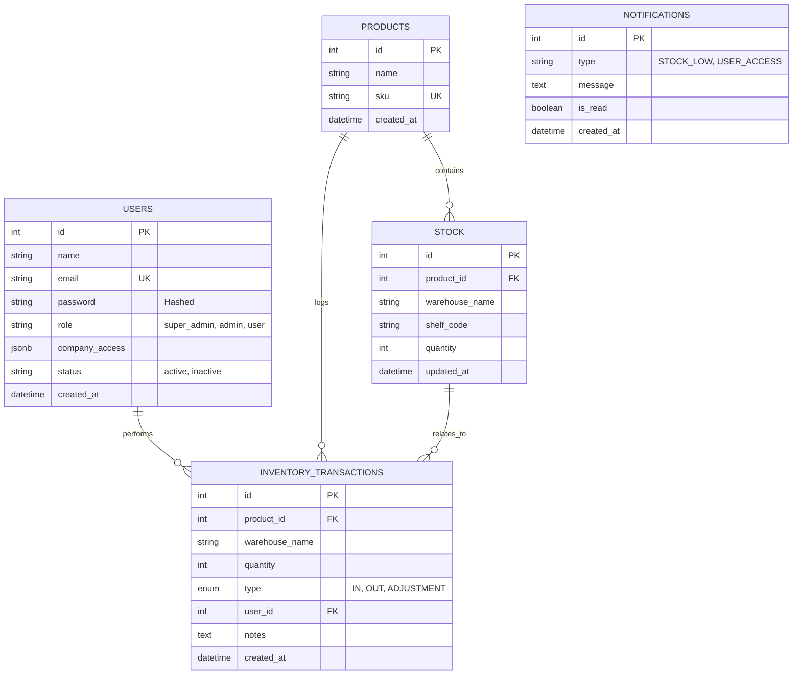

# Phoenix Inventory: Architectural Overview

This document provides a complete technical layout of the Phoenix Inventory system, detailing the software architecture, data flow, database schema, and deployment strategies optimized for **Windows** environments.

---

## 1. High-Level System Architecture

The system follows a classic **Three-Tier Architecture**, containerized using Docker for consistency across development and production.

---

## 2. Process Flow Representations

### 2.1. Request Lifecycle: Stock Update
This diagram illustrates the process when a user updates stock levels.

### 2.2. Authentication Flow

---

## 3. Database Schema (PostgreSQL)

### 3.1. Entity Relationship Diagram (ERD)

---

## 4. Deployment on Windows

### 4.1. Optimized Environment
For production-grade delivery on **Windows**, we utilize **Docker Desktop** with the **WSL2 (Windows Subsystem for Linux)** backend. This provides near-native performance for PostgreSQL and Node.js.

- **Recommended OS**: Windows Server 2022 or Windows 11 Pro.
- **Backend**: Docker Desktop (WSL2 Engine).
- **Frontend Serving**: Nginx container (serving Vite static builds).

### 4.2. Windows Server Access
1.  **Remote Access**: Use **Remote Desktop Protocol (RDP)** for GUI-based management.
2.  **Command Line**: Standardize on **PowerShell 7 (Core)** for scripting.
3.  **Environment Management**:
    - Use System Environment Variables or `.env` files mapped via `docker-compose.yml`.
    - Secure secrets using **Windows Credential Manager** or external Vaults if necessary.

---

## 5. Industry Standards & Optimization

### 5.1. Standards Used
- **RESTful API Design**: Predictable resource-based URLs.
- **JWT (JSON Web Tokens)**: Stateless authentication for scalability.
- **Bcrypt**: Adaptive hashing for password security.
- **ACID Transactions**: Ensuring DB integrity (Knex Transactions).
- **SemVer**: Semantic Versioning for releases.

### 5.2. Optimization Strategies
- **Database Indexing**: Indexes on `SKU`, `product_id`, and `created_at` for sub-second query performance.
- **Rate Limiting**: `express-rate-limit` to prevent Brute Force on Auth endpoints.
- **Compression**: `gzip` enabled via Nginx for faster frontend delivery.
- **Connection Pooling**: PostgreSQL connection pooling handled via `pg` and `Knex`.
