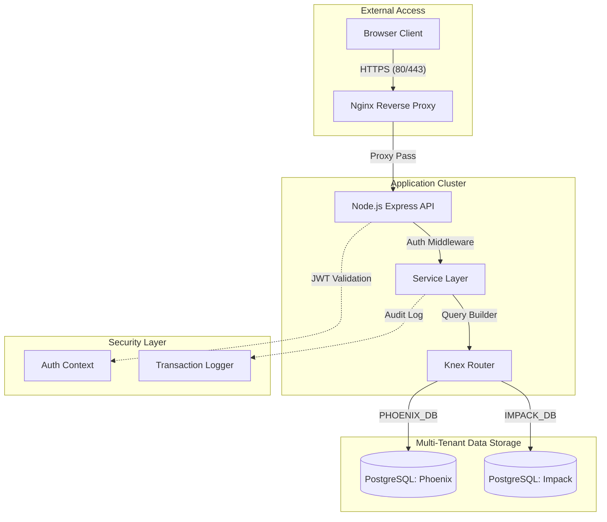
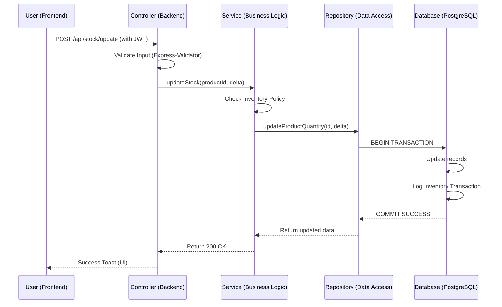
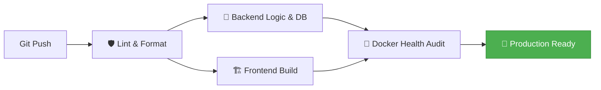

# 🏷️ Phoenix Inventory: Enterprise Logistics Intelligence

**Phoenix Inventory** is a high-performance, secure, and multi-tenant inventory management system designed for organizational logistics. It features a robust **React/Vite** frontend and a **Node.js/Express** backend, optimized for reliability and auditable stock movements.

---

## 🏗️ System Architecture

The following diagram illustrates the high-level architecture of the Phoenix system, showing the interaction between the edge-layer Nginx, the core application, and the multi-tenant database cluster.



---

## 🔄 Request Lifecycle: Stock Update Flow

This sequence shows how a single stock adjustment request is processed through the layered architecture.



---

## 🚀 Rapid Deployment & Setup

### 1. Prerequisites
- **Docker Desktop** (WSL2 Backend recommended for Windows).
- **Node.js 20.x** (for local development/testing).

### 2. Environment Configuration
Copy the template and provide your secure credentials:
```bash
copy .env.example .env
```

### 3. One-Click Start
```bash
docker-compose up --build -d
```
*The system will automatically run all database migrations and start the UI at [http://localhost](http://localhost).*

---

## 🧪 CI/CD: Automated Verification Pipeline

We maintain a strict **GitHub Actions** pipeline to ensure all features are verified before release.



### Verified Features in CI:
- **Deduplication Logic**: Ensures no duplicate SKUs are created.
- **Cascading Deletions**: Verifies "non-stick" deletion (no orphaned records).
- **Migration Integrity**: Checks that all DB changes are forward-compatible.

---

## 🔐 Multi-Tenant Isolation (Phoenix vs Impack)
Phoenix Inventory supports a dual-tenant architecture for organizational sub-entities:
- **Isolated Databases**: Complete data segregation between `phoenix` and `impack` tenants.
- **Role-Based Access**: Granular control for `super_admin`, `admin`, and `user` roles across all sub-companies.

---

## 🛠️ Project Sharing & Contribution
To share this project or set it up for a new team:
1.  **Reference [SETUP.md](file:///d:/inventory-system/SETUP.md)** for detailed local development onboarding.
2.  **Refer to [ARCHITECTURE.md](file:///d:/inventory-system/ARCHITECTURE.md)** for deep-dive technical specs.
3.  **Check [TESTING_SEQUENCE.md](file:///d:/inventory-system/TESTING_SEQUENCE.md)** for the manual validation protocol.

---
Verified by Antigravity
